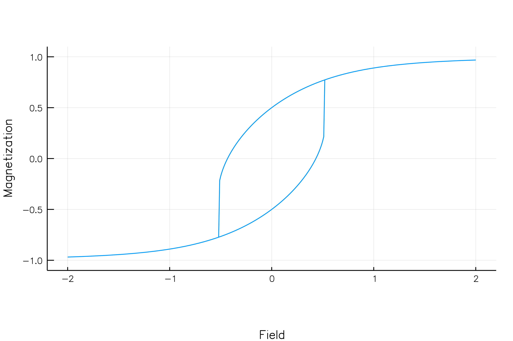
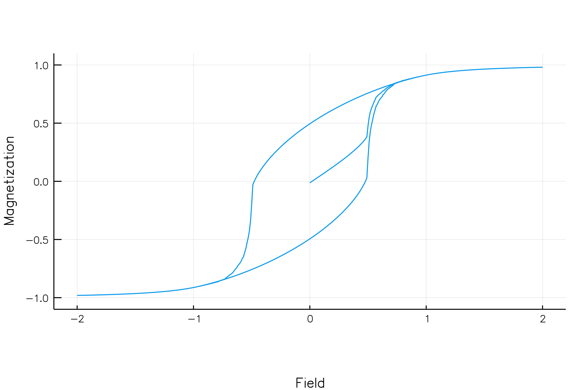
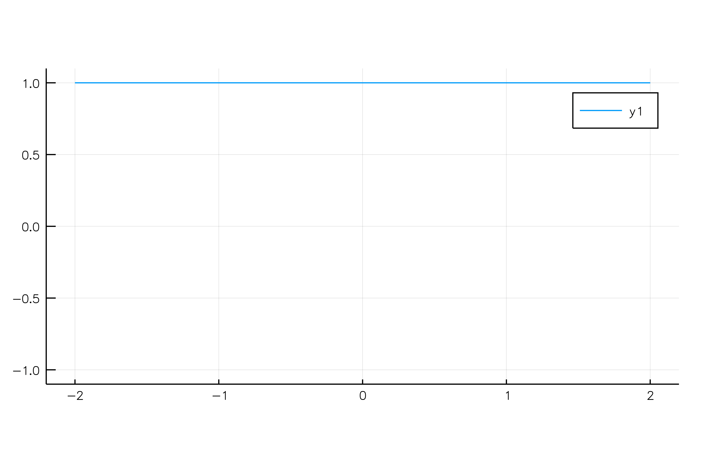

# Magnetic particles, their magnetization and movement
* `StonerWohlfarthModel` module contains types representing different models of magnetic particles. A set of useful functions allows one to simulate distribution of particles, calculate their curves of magnetization.
* `RandomSpherePoints` allows one to obtain random uniform distribution of directions (unit radius-vectors). This tool is useful during simulation ransom isotropic distribution of directed particles.


## Usings
```julia
using StonerWohlfarthModel, 
```

## Stoner-Wohlfarth particles
Magnetization according to the well-known model of a single domain ferromagnetic particle can be simulated using `draw_representation` function, which accepts the value of angle between the anisotropy axis and the applied magnetic field:
```julia
ψ=60*pi/180
draw_representation(ψ)
```



Distribution of directions can be generated using the `RandomSpherePoints` module and its functions. Let us create N unit-vectors distributed randomly on the unit sphere:
```julia
using RandomSpherePoints
N = 1000
directions = get_points_spherical_random(N)
``` 
`get_points_spherical_random` function creates vectors with spherical coordinates (r θ ϕ). In turn, the `get_points_cartesian_random` returns vectors with Cartesian coordinates (x y z).


We then can calculate magnetization loop of randomly oriented Stoner-Wohlfarth particles:
```julia
psis = directions[:,2]
hstep = 0.01
hmax = 2.0
h = [collect(0:hstep:hmax); collect(hmax:-hstep:-hmax); collect(-hmax:hstep:hmax)]
#display(@btime m=calculate_particles(psis, h))
m=calculate_particles(psis, h)
```
Using `Plots.jl` we can draw the magnetization curve:
```julia
using Plots
plot(h,sum(m,1)'/N, xlim=(-2.2, 2.2), ylim = (-1.1, 1.1), aspect_ratio=[1 2], legend=:none, xlabel="Field", ylabel = "Magnetization")
``` 



Let us present animation of a set of the Stoner-Wohlfarth particles with different anisotropy angle:



## Multigrain magnetic particles

`Usov2016` module contains representation of multigrain magnetic microparticles. Results of his simulations can be found in [1]. The `UsovParticle` type represents those microparticles.

# References
1. N.A. Usov and O.N. Serebryakova, Universal behavior of dense clusters of magnetic nanoparticles, AIP Advances, 6, 2016, p. 075315